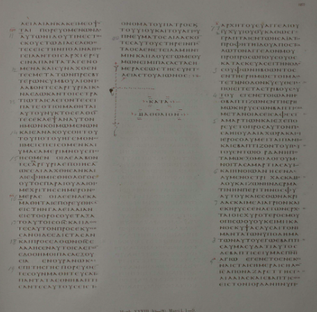
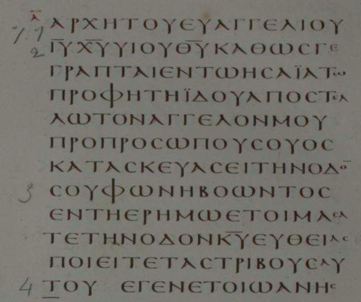
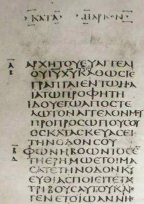

# ÉVANGILE SELON MARC

## Ouverture : Mc 1,1-15

Notons que les traductions proposent différentes ponctuations.

C'est inévitable puisque les manuscrits du NT n'ont pas de ponctuation.

Les différentes traduction peuvent parfois présenter des variantes en raison de la diversité des manuscrits.

# "Commencement de l'Évangile..."

* parole d'ouverture avec citation de l'Écriture

* Jean, le baptiseur : proclamation

* arrivée de Jésus de Nazareth en Galilée et baptême : voix du ciel

* tentations au désert

* Jésus en Galilée : proclamation

## Unité du passage ?

On peut commencer par relever les indices habituels : lieux, temps, personnages

### Lieux : où ?

* v. 4 : dans le désert

* v. 9 : dans le Jourdain (Jésus se déplace depuis la Galilée)

* v. 12 : désert

* v. 14 : retour en Galilée

### Temps : quand ?

v. 9 : en ces jours-là

v. 12 : aussitôt (après le baptême) => durant 40 jours

v. 14 : après que Jean eut été livré

### Personnages : qui ?

* v. 4 Jean (celui qui baptise)

* v. 5 "tout le pays de Judée et tous les habitants de Jérusalem"

* v. 9 Jésus

* v. 10 L'Esprit

* v. 11 une voix !

* v. 13 Satan, bêtes sauvages, anges

Ces observations permettent de diviser Mc 1,1-15 en petites-unités (ce que font les éditions bibliques).

Il y a une diversité de personnages... et pourtant une sorte d'unité autour de Jean

* c'est le premier personnage nommé au v.4

* il est nommé de nouveau au v. 14 : "après que Jean eut été livré"

### Vocabulaire ?

le mot Évangile apparaît 3 fois :

v. 1 "Commencement de l'Évangile de Jésus..."

v. 14  "il proclamait l'Évangile de Dieu"

v. 15 "Croyez en l'Évangile"

Une recherche de concordance montre que *εὐαγγέλιον* est utilisé :

* 4 fois en Mt

* 8 fois en Mc dont 3 fois au chap 1 :

  * au début

  * à la fin de notre passage

* 0 fois en Lc, en Jn

* 2 fois en Ac

* 60 fois dans les lettres pauliniennes

* 1 fois en 1P

* 1 fois en Ap

### délimitation

On a une "inclusion" : les v. 1-15 sont INCLUS entre

* la première mention de "Évangile"  (au v.1)

* la troisième mention de "Évangile"  (au v.15)

Noter le vocabulaire lié à la PAROLE dans ces premiers versets

* voix (2 fois)

* cri

* proclamer (3 fois)

* dire (2 fois)

les v.14-15 jouent un rôle de **charnière** en Mc :

* après que Jean eut été livré... "le temps est accompli"

* dans la suite, Jean n'interviendra plus.

  * Mc 6 racontera la mort de Jean

  * mais Jean n'interviendra plus comme un acteur du récit.

au v. 16 : Jésus se déplacera vers un nouveau lieu:  "**mer** de Galilée".  Ce lieu (la "mer") va jouer un grand rôle par la suite.  C'est le début d'une nouvelle unité, sans Jean, en Galilée.

Le "commencement de l'Évangile" se déploie dans ces 15 premiers versets !

# Lecture des sous-unités

## Où terminer la première sous-unité ?

#### v. 1 = TITRE ?

> Commencement de l'heureuse annonce de Jésus Christ Fils de Dieu.

Dans ce cas, la citation d'écriture (v.2) est le début d'une nouvelle unité de sens : elle se relie à ce qui suit

- Ainsi qu'il est écrit... Jean parut dans le désert

> Commencement...

Il ne s'agit pas simplement du début du livre ! Quelque chose commence, mais il faudra lire la suite pour essayer de savoir quoi, exactement !

> évangile

on peut traduire : "bonne nouvelle", "heureuse annonce". Ce qui peut désigner

* le contenu : ce qui est annoncé

  * *lisez bien les annonces de cette semaine*

* l'action d'annoncer :

  * *puis-je faire une annonce ?*

Pour compliquer un peu, "évangile" a aussi le sens de "livre" = un des quatre évangiles !

Nulle part en Mc le mot "évangile" ne désigne le "livre". Par ex:

> à cause de moi, et de l'évangile

Mais le mot Évangile s'entend bien comme ACTION, et aussi comme contenu.

On peut donc lire de plusieurs manières l'expression "Évangile de Jésus"

* ACTION : évangile que Jésus proclame (comme au v. 14)

  * Jésus est le sujet qui annonce

  * Jésus fait cette annonce en tant que Messie (Christ), en tant que Fils de Dieu

* Contenu : évangile qui annonce **Jésus**

  * Jésus est l'objet de l'annonce

  * dans ce cas, Jésus est annoncé **comme** Christ et Fils de Dieu

  * *Jésus Christ Fils de Dieu* est alors en "résumé", l'essentiel de ce qui est annoncé.

Les deux lectures sont intéressantes.

On remarque que Jésus est confessé comme Christ par Pierre, en Mc 8, 29

> Tu es le Christ

Jésus est confessé comme Fils de Dieu en Mc 15, 39

> Vraiment, cet homme était Fils de Dieu

Le livre propose donc une sorte d'itinéraire en deux parties à la découverte de Jésus. Il faudra regarder plus en détails comment cela fait sens.

En particulier : la signification de "Messie" ou de "Fils de Dieu" n'est PAS donnée dès le début. Au contraire, elle se construit peu à peu, à travers tout le livre.

LIRE Mc du début à la fin, c'est se mettre à l'école du texte, pour chercher à comprendre ce que ces mots signifient.

Attention : dans ce cours, on ne va pas réciter notre catéchisme, mais étudier comment le texte construit du sens, notamment pour "Christ", "Fils de Dieu" etc...

La lecture doit permettre de passer d'une première compréhension des mots, à une compréhension plus fine, suivant la perspective de l'Évangile selon **Marc** !

## v. 1-3 : un commencement ?

Dans le NT, "Ainsi qu'il est écrit" se réfère habituellement à ce qui précède, mais pas à ce qui suit ! Par ex :

> Mc 9,13 Mais je vous dis qu’Elie est venu et qu’ils l’ont traité comme ils voulaient, selon ce qui est écrit de lui.

On peut donc lire la citation d'écriture dans le prolongement du v. 1.

* Commencement ... **ainsi qu**'il est écrit

* Bonne nouvelle ... **ainsi qu**'il est écrit

* Jésus Christ Fils de Dieu ... **ainsi qu**'il est écrit

Il faut lire de plus près les v. 2-3 !

Le texte de Mc cite ainsi l'Écriture :

> 2b Voici, j’envoie mon messager en avant de  toi,
> pour préparer  **ton** chemin.
> 3 Une voix crie dans le désert :
> Préparez le chemin du Seigneur,
> rendez droits **ses** sentiers.

Mc est le seul des trois synoptiques à faire précéder la citation d'Isaïe (v.3) d'une autre citation (v.2b) : il faut se demander ce que le v. 2b apporte comme éclairage !

Le références marginales et les notes des bibles indiquent :

* v. 2b : Ex 23,20 et Ml 3,1

  * Quant à moi, j’envoie un messager devant **toi**, pour **te** garder sur le chemin

  * J’envoie mon messager : il fraiera un chemin devant **moi**  

* v. 3 : Es 40,3 (grec)

  * Une voix crie dans le désert :
    Préparez le chemin du Seigneur,
    rendez droits les sentiers **de notre Dieu**

  * Mc : rendez droits les sentiers de **LUI**

Quelques remarques :

* les citations ne sont pas exactes : est-ce grave ?

  * non car elles peuvent être faites de mémoire

  * en suivant plus ou moins le texte grec : LXX

  * ou en retraduisant depuis l'hébreu

  * et surtout, la "citation" est une PAROLE qui construit du SENS : sa formulation peut être "adaptée" à la signification qu'elle éclaire.

  * c'est un travail d'INTERPRÉTATION qui s'opère, et non de simple "vérification" de "conformité" entre l'AT et le NT.

* toute la citation n'est pas d'Isaïe

  * il est instructif que ce soit Isaïe qui soit cité : certes il est le plus "célèbre" des prophètes écrivains

  * et aussi : la partie du texte qui provient d'Isaïe est citée au v.3. Elle est **précédée** par une citation combinée d'autres textes qui fournissent une clé de lecture.

* à la différence de Mt, il n'y a de "citation d'accomplissement" en Mc : il va falloir interpréter différement Mc et Mt.

  * Mc ne s'adresse pas à des croyants d'origine juive.

  * il ne construit pas une théologie d'accomplissement des écritures !

  * on peut même s'étonner que Mc s'ouvre avec cette référence aux écritures, si ses lecteurs sont peu familiers avec l'AT...

Que se passe-t-il dans la citation d'écriture en Mc ?

> 2b Voici, j’envoie mon messager en avant de  toi,
> pour préparer  **ton** chemin.
> 3 Une voix crie dans le désert :
> Préparez le chemin du Seigneur,
> rendez droits **ses** sentiers.

Qui sont les personnages **dans** ce texte ?

* v. 2b

  * je

  * mon messager

  * toi

* v. 3

  * une voix

  * le Seigneur

La VOIX (v.3) doit PRÉPARER, comme le MESSAGER au v. 2.

* voix = messager

* je = le Seigneur

* tu = ?

  * au v.2  : **ton** chemin

  * au v. 3 : le chemin **du Seigneur** // **ses** sentiers

Cette citation est donc une PAROLE adressée par JE (le Seigneur) à TU (qui n'est pas nommé) au sujet d'un MESSAGER-VOIX (3ème personnage, que la suite identifie avec Jean)

> Voici

Cette parole est un acte, une "annonce" : une "bonne nouvelle" ?

Le COMMENCEMENT DE L'ÉVANGILE peut très bien désigner cet événement de parole :

* AVANT que Jean paraisse dans le désert

* le Seigneur ANNONCE l'envoi d'un messager

* il s'adresse à TOI : un personnage qui n'est pas nommé, mais qui est doté d'une envergure divine incroyable !

Bien sûr, Mc 1 n'est pas le prologue de Jean ! Néanmoins

* l'Écriture (v.2-3) n'annonce pas simplement que Jean le Baptiste va accomplir la mission prévue par Dieu depuis des siècles

* ce passage révèle l'extraordinaire d'une RELATION

  * entre le messager (JB) et celui dont il prépare le chemin (Jésus)

  * mais aussi entre le Seigneur, et celui à qui il dit "TU"

  * "TU" n'est pas envoyé, mais SON chemin est le chemin du Seigneur.

## v.4 Jean "le baptiste"

"dans le désert"

* cette mention relie Jean à l'Écriture qui précède.

* C'est lui le "messager", la "voix".

il "proclame" (deux fois : v. 4, 7) : c'est typique de l'activité prophétique

* mais il ne proclame pas d'abord des mots !

* v. 4 il proclame "un baptême" (plongée dans l'eau)

* "conversion" : *μετάνοια*

  * changement de direction (comme l'hébreu שׁוּב )

  * en grec il s'agit plutôt de changer d'avis, changer de pensée, changer d'attitude intérieure => se raviser

  * "changement radical" (à la racine...)

* ce changement intérieur se manifeste dans le baptême, et dans la confession des péchés (qui sont des actions visibles)

  * noter l'hyperbole : "tout le pays de Judée" !

  * il ne s'agit peut-être pas d'insister sur la quantité de personnes qui vont au Jourdain,

  * mais sur le mouvement d'un peuple : il ne s'agit pas seulement d'un changement individuel dans la mission de Jean

  * le 'pardon des péchés' peut s'entendre des péchés personnels, et aussi des péchés du peuple

* v. 6 : l'apparence de Jean rappelle le prophète Elie (voir 2R 1,8)

* v. 7 : Jean annonce un "plus fort" qui "vient" => au v. 9, Jésus "vint" (on retrouve le thème du "chemin" cité dans l'Écriture)

* v.8 :  baptême d'Esprit Saint ?

  * c'est d'autant plus étonnant que, dans la suite du texte, Jésus ne baptise pas d'Esprit Saint

  * le verbe "plonger"  fonctionne mal avec  "l'Esprit Saint"  

  * MÉTHODE : si on ne sait pas très bien ce qu'est un "baptême d'Esprit Saint"... on ne cherche pas à INVENTER...

  * c'est une métaphore, dont la signification reste très énigmatique

  * une chose est claire cependant sur "LUI" : le plus fort baptisera *autrement*, de manière plus mystérieuse et plus sainte.

> Comme Jean baigne le baptisé dans l'eau, celui qui "vient" rendra possible une plongée dans un "souffle" capable de pénétrer l'homme d'une "sainteté" qui l'apparente au Dieu Saint  Delorme, I. p. 52

### de quelle manière Jean "prépare-t-il le chemin ?"

* au v.2 le messager doit "préparer"

* au v. 3 la voix crie (à l'impératif) : "préparez !"

  * celui qui crie n'est pas ici celui qui prépare : il commande à ceux qui l'écoutent de "préparer"

* aux v. 4-8 : comment Jean "prépare-t-il"

  * le baptême de Jean n'est pas le BUT, mais le MOYEN de préparer

  * Jean annonce non seulement un baptême, mais un "plus fort"

  * la "préparation" se trouve aussi dans l'annonce de ce plus fort qui VIENT

  * il y a une rencontre, encore mystérieuse, qui est préparée par l'évocation de la grandeur de celui qui vient, dont le baptême d'Esprit manifeste la puissance, sans dévoiler le mystère.

## v. 9 Jésus "vint"

Contrairement à ce que Jean annonçait, Jésus ne baptise pas : il est baptisé !

Jésus n'est pas baptisé "en confessant ses péchés" => on ne peut pas comprendre le baptême de Jésus en simple continuité avec celui de "tout le pays".

A partir du v. 9 Jean n'agit plus : il fait place à Jésus et à la manifestation divine.

En Mc, c'est JÉSUS qui "vit" l'Esprit, et c'est à LUI que s'adresse la voix des cieux.

> Tu es mon Fils bien-aimé, en toi j'ai mis mon bon plaisir.

Cette parole est remarquable :

* c'est une parole qui s'adresse en TU à Jésus

* comme la parole d'Écriture au v. 2 (qui est propre à Mc)

Comment comprendre le mot "Fils" (v. 1  et v. 11) ?

* dans le texte, le Fils est celui à qui la voix divine dit "TU"... dès  le "commencement de l'Évangile", bien avant l'arrivée de Jean.

* "bien aimé" "bon plaisir" => qualifie la RELATION

* cette relation est absolument unique, et fondatrice

* les cieux DÉCHIRÉS caractérisent la dimension "verticale" de cette relation

  * descente de l'Esprit

  * remontée de Jésus

AUSSITÔT...

## v. 12-13 : tentation au désert

Lire Mc nécessite de ne pas ajouter au texte des éléments qui proviennent de Mt // Lc.

Ce n'est pas très facile, car Mc est très bref

> et aussitôt l'Esprit le chasse vers le désert
>
> et il était dans le désert quarante jours
>
> tenté par Satan
>
> et il était avec les bêtes sauvages
>
> et les anges le servaient.

#### quelques éléments propres à Mc

* le verbe "pousser"

  * L'Esprit pousse Jésus au désert en Mc : c'est l'Esprit qui est le sujet du verbe *ἐκβάλλω*, à la voie active.

  * en Mt // Lc, Jésus est conduit par l'Esprit : c'est Jésus qui est le sujet du verbe *ἀνάγω*, à la voie passive.

  * le verbe "pousser" signifie aussi "chasser" : littéralement jeter dehors.

  * Mc est un peu plus rude que Mt // Lc et souligne davantage l'initiative de l'Esprit.

* il était avec les bête sauvages

  * ni Mt ni Lc ne mentionnent les "bêtes sauvages" : *θηρίον*

* tout ce que Mc ne raconte PAS

  * Mc n'écrit pas que Jésus jeûne, ni qu'il a eu faim...

  * il ne détaille aucune tentation précise

  * il n'écrit pas "le diable le quitta" à la fin du récit

> et aussitôt l'Esprit le chasse vers le désert et il était dans le désert quarante jours tenté par Satan et il était avec les bêtes sauvages et les anges le servaient.

* remarquer le temps des verbes : imparfait => durée

En Mt, Jésus commence par jeûner 40 jours, puis il a faim, puis le diable lui parle. Il est possible de lire Mt comme si la tentation débutait vraiment au 40ème jour... Mais on ne peut pas lire Mc de la même façon.

* "aussitôt"

  * Mc relie très fortement le baptême et le récit de la tentation au désert

  * il souligne l'initiative de l'Esprit qui "chasse" Jésus vers le désert

* "chasser"

  * Mc souligne que Jésus subit ce départ au désert

* "désert"

  * le mot figure 2 fois : insistance de Mc.

  * en Mt (qui est plus long), le mot désert ne figure qu'une fois.

  * même chose en Lc

  * Jean aussi était "dans le désert"... mais

  * le désert de Jean est caractérisé en Mc par : le Jourdain, des sauterelles, du miel sauvage... et un grand nombre de gens qui viennent !

  * le désert où se trouve Jésus est caractérisé par : Satan, des bêtes sauvages, et des anges. Et c'est un lieu où on est poussé.

  * au v. 12-13, le désert est un lieu de combat, et il s'agit d'un combat "spirituel" puisqu'il mobilise des êtres spirituels comme Satan et les anges.

* "quarante jours"

  * il y a dans l'AT de nombreuses périodes de 40...

  * pour le peuple : 40 ans dans le désert

  * pour Moïse : 40 jours sur la montagne

  * pour Elie : 40 jours de marche jusqu'à l'Horeb

* "quarante jours" ? La question est : Mc construit-il son texte en faisant allusion à l'un de ces éléments de l'AT ? Si oui, on peut chercher quel sens cela construit :

  * quels sont les éléments de l'AT qui sont repris comme significatifs pour Jésus ?

  * quelles nouveautés y a-t-il avec Jésus par rapport à l'AT ?

* "quarante jours" : ce n'est qu'un indice... qui ne suffit pas à déterminer une allusion précise.

  * l'allusion à Moïse est visible en **Mt**... pas en Mc !

  > Mt 4,2 : Après avoir jeûné quarante jours et quarante nuits, il eut faim

  * Jésus **jeûne** : comme Moïse

  * Mt précise "quarante jours **et quarante nuits**", en écho à l'Exode

  > Ex 24,18 :  Moïse fut dans la montagne **quarante jours et quarante nuits**
  >
  > Ex 34,28 : Moïse resta là, avec le Seigneur, **quarante jours et quarante nuits**. Il ne **mangea** **rien**, il ne but rien

  * mais en Mc... il n'y a pas tellement d'indications qui évoquent Moïse. Attention de ne pas trop solliciter le texte, dans une direction qui n'est pas la sienne !

* "tenté" ou "mis à l'épreuve"

  * **tenté** de faire le mal ?

  * ou **éprouvé** ?

  * le deuxième sens est meilleur ici : le texte ne dit rien sur ce que fait Jésus pendant tout ce temps, il insiste sur la durée d'une épreuve.

  * ici, l'enjeu de l'épreuve n'est pas détaillé : attention de ne pas imaginer ce que le texte ne raconte pas.

* "Satan"

  * c'est la première mention du personnage de **l'adversaire**.

  * c'est une figure d'hostilité aussi bien envers Dieu qu'envers les humains.

  * inutile de chercher à en savoir plus sur Satan lui-même... le texte ne donne aucun élément ! (et le péché originel n'est pas un thème de la théologie de Mc)

* "les bêtes sauvages"

  * elles s'opposent aux animaux domestiqués : ce sont des animaux qui fuient la compagnie humaine, ou qui peuvent être dangereux.

  * figure d'hostilité => caractérise le désert comme un lieu où la vie est en danger.

* "il était avec les bêtes sauvages"

  * Jésus n'est pas en lutte **contre** les bêtes sauvages, mais il est **avec** elles (dans la durée soulignée par l'imparfait)

  * l'hostilité qui se trouve du côté des "bêtes" ne se retrouve pas du côté de Jésus.

  * les notes des bibles indiquent des références comme Is 11,6-9

  > Es 11,6 Le loup séjournera avec le mouton, la panthère se couchera avec le chevreau ; le taurillon, le jeune lion et les bêtes grasses seront ensemble, et un petit garçon les conduira

  * ouverture vers ce qui est espéré pour les derniers temps => eschatologie.

  * on peut également observer que le terme "bête sauvage" (*θηρίον*) figure dans le texte grec de la Genèse

  > Gn 1,24 : Dieu dit : Que la terre produise des êtres vivants selon leurs espèces : bétail, bestioles, bêtes sauvages
  >
  > Gn 2,19 : Le Seigneur Dieu façonna de la terre toutes les bêtes (*θηρίον*) de la campagne et tous les oiseaux du ciel. Il les amena vers l’homme pour voir comment il les appellerait.

  * Jésus "était" : verbe à l'imparfait de durée.

* Cet état qui dure est chargé de sens : peut-être dans deux directions (contraires?)

  * être avec les bêtes **sauvages**, c'est être dans l'épreuve :  "votre épreuve consistera à rester 40 jours au désert avec les bêtes sauvages"

  * être **avec** les bêtes sauvages, c'est être dans une forme de réconciliation, qui évoque la création des origines, et qui est espérée pour les derniers temps.

  * le texte permet les deux significations

  * et même il les maintient toutes les deux : Mc ne chante **pas** le *triomphe* de Jésus sur l'adversité (l'épreuve est une véritable épreuve) MAIS cette épreuve est endurée dans un climat de paix, chargé d'espérance.

* "les anges"

  * ici, ce ne sont pas des messagers (le mot grec *ἄγγελος* a les deux sens)

  * les anges "le servaient" : le sens est probablement celui de la nourriture (d'autant plus que Jésus ne jeûne pas)

  * le service des anges manifeste l'importance de Jésus lui-même

  * dans le texte, Satan et les bêtes sauvages sont "encadrés" par l'Esprit et les anges

> et aussitôt <mark>l'Esprit</mark> le chasse vers le désert
>
> et il était dans le désert quarante jours
>
> tenté par Satan
>
> et il était avec les bêtes sauvages
>
> et les <mark>anges</mark> le servaient.

### enjeu théologique

C'est l'être de Jésus qui est en jeu dans ce passage ("il était...")

Il ne s'agit pas de reconstituer la scène de la tentation !

Ce récit nous fait entrer dans un "désert" dont l'enjeu est spirituel : l'ensemble des versets 10-13 déploie un monde spirituel devant le lecteur.

En Mc, ce passage est fortement relié à son contexte, spécialement le baptême qui précède, et la parole des cieux.

Pour Jésus, être **Fils** semble signifier "aussitôt" être éprouvé dans l'adversité spirituelle.

Dès l'ouverture du livre, l'être de Jésus rencontre une opposition spirituelle : le lecteur devra s'en souvenir en lisant les nombreux récits d'exorcisme de Mc.

## v.14-15 : charnière

> 14Après que Jean eut été livré, Jésus vint en Galilée.  Il proclamait l’Evangile de Dieu et disait :
> 15« Le temps est accompli, et le Règne de Dieu s’est approché :  convertissez-vous et croyez à l’Evangile. »

* "vint"

  * le verbe **venir** est utilisé pour Jésus au v. 9 puis au v.14

  * v. 9 : "celui qui **vient** après moi..." proclamait Jean

  * ce vocabulaire fait écho au "chemin" de la citation d'Écriture v. 2-3.

* "Évangile" : ce mot apparaît 3 fois en Mc 1,1-15

  * "Commencement de l’Evangile de Jésus Christ Fils de Dieu" (v.1)

  * "l’Evangile de Dieu" (v.14)

  * "l’Evangile" (v.15)

Lorsque le même mot est utilisé, est-ce forcément le même sens ?

Ce n'est pas évident !

"l’Evangile de Dieu" :

* qui provient de Dieu (comme sa source)

* ou qui parle de Dieu (comme son thème)

Ce qui est remarquable est le dernier usage, au sens absolu : "l’Evangile".

Le même mot est répété en des sens qui sont voisins, mais peut-être pas identiques.

* v. 14 : Jésus lui-même proclame l'Évangile

  * mais il ne réfère pas cet évangile à lui-même,

  * cet évangile est ouvert sur "Dieu", comme les cieux se sont déchirés et ont permis à la voix divine de résonner.

* v. 15 : croyez à l'Évangile

  * il faut lire tout le verset pour essayer de mieux comprendre !

On peut comparer Mc 1,14-15 avec Mt 4,17

> Mc 1,14-15  
> <u>Le temps est accompli</u>, et le Règne de Dieu s’est approché  
> convertissez-vous et <u>croyez à l’Evangile</u>.

> Mt 4,17  
> Dès lors Jésus commença à proclamer : convertissez-vous, car le Règne de Dieu s’est approché.

=> Mc est le seul à insister sur le "bon moment" qui est "rempli", et sur l'appel à "croire à l'Évangile".

> Le temps est accompli

* on peut traduire aussi : le moment favorable est rempli

  * non pas *χρόνος* (le temps chronométré), mais *καιρὸς* (le temps vécu)

* "est accompli" (*πεπλήρωται*) : le verbe est au parfait

  * action passée

  * dont les conséquences sont encore présentes

* Jésus proclame ce moment nouveau : à qui ?

  * le texte ne le précise pas : ni lieu, ni contexte à ces v. 14-15

  * Jésus s'adresse à un "vous" qui n'est pas précisé

  * ces deux versets sont destinés au lecteur.

  * pour comprendre "ce que fait Jésus" (et qu'il va faire dans tout le livre)

  * pour se laisser interpeller par Jésus !

> et le Règne de Dieu s’est approché

* on peut traduire *βασιλεία* par

  * royauté, souveraineté (*kingship*)

  * ou royaume (*kingdom*)

  * ou règne (*reign*)

* ce mot a donc plusieurs  significations, dont deux (au moins) peuvent convenir avec le verbe "approcher" :

  * la signification spatiale : royaume

  * la signification temporelle : règne.

* le verbe "s'est approché" est au parfait en grec

  * comme  le moment "est accompli" (au parfait),  le règne "est proche"

  * mais avec la différence que "être proche" n'est pas tout à fait "être présent".

* les deux impératifs "convertissez-vous et croyez à l'Évangile" prennent place dans ce temps particulier fait d'accompli et de proximité

  * en grec : impératif présents

  * nuance de durée : les deux actions sont appelées à durer !

Dans le contexte de Mc, le "bon moment" coïncide avec "après que Jean eut été livré".

* le bon  moment accompli semble être celui de Jean, qui est venu préparer le chemin : cette préparation ouvre à une "rencontre" avec la venue d'un "plus fort"

* mais le "bon moment"" ne vient pas juste après que Jean a baptisé le peuple : il vient après

  * la parole des cieux adressée à Jésus (et lui seul) qui atteste de son lien unique avec Dieu (le Père)

  * les quarante jours au désert qui habilitent Jésus à "être Fils" dans le combat spirituel qui oppose Satan à l'Esprit (et les anges).

* ce "bon moment" est chargé d'enjeu spirituel, et il ouvre une certaine durée marquée par la proximité du Royaume / Règne / Royauté.

> Convertissez-vous

* à la différence du v. 4, il n'est pas question ici du péché (pardon des péchés)

* il s'agit moins ici de renoncer au mal que d'entrer dans une manière nouvelle de "penser".

#### Évangile...

> C. FOCANT [p.78] la proclamation programmatique du v.15 énonce de qui est fait et ce qui reste à faire. L'**"Évangile"** articule l'affirmation de l'accompli (le *kairos*) et du tout proche (la *basileia*) avec l'appel à un sujet d'écoute ("vous") interpellé dans son désir et placé devant l'urgence d'une transformation à réaliser en lui-même.

"croire dans l'Évangile"

* il ne s'agit pas de savoir, ou comprendre avec le cerveau

* il s'agit de répondre à l'appel lancé par Jésus

  * par une attitude fondamentale d'écoute

  * qui reste ouverte à tout ce que la suite du livre va présenter

# Pour conclure : "Commencement..."

#### Mc 1,1-15

Le commencement de l'Évangile peut désigner la **période** avant que Jean ait été livré, jusqu'à la "charnière" des v. 14-15. C'est à dire toute la "préparation" au ministère public de Jésus.

#### Mc 1,4

Le commencement de l'Évangile peut désigner plus spécifiquement la mission de Jean le Baptiste, le "messager" qui "prépare".

#### Mc 1,2

Le commencement de l'Évangile peut désigner la **parole**, adressée par Dieu à Jésus. Parole citée dans les Écritures, bien avant l'apparition de Jean le Baptiste, et offerte au lecteur comme une clé pour tout l'Évangile.

# Pour conclure : "Évangile"

> J. DELORME [p.91] "L'heureuse annonce de Jésus Christ Fils de Dieu" n'est pas le livre de Marc, mais la réalité dynamique, la parole agissante, à laquelle le livre renvoie hors de lui.
>
> [...]
>
> "l'heureuse annonce de Dieu" proclamée en Galilée en fait déjà partie et prépare à la comprendre et accueillir de manière nouvelle au bout du parcours intégral du livre.
>
> [...]
>
> Nous avons tellement l'habitude de concevoir "l'heureuse annonce" comme un *message* de ou sur Jésus Christ que nous avons du mal à la comprendre comme une *action* qui s'exerce dans le temps. C'est une action divine en cours [...]
