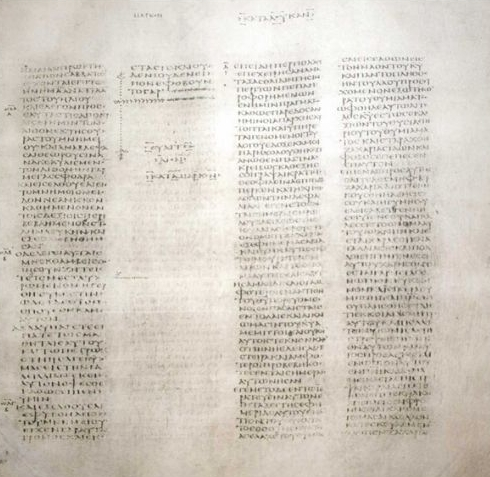
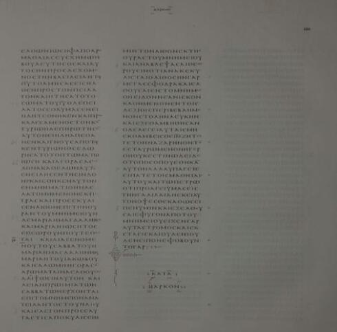
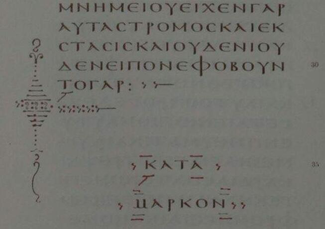

# ÉVANGILE SELON MARC

## La mort et la résurrection

Pour écrire un évangile, il faut relever un défi "insurmontable" : raconter la crucifixion du Messie !

* Jean le Baptiste a été mis à mort :
  
  * sur ordre d'Hérode
  
  * parce que l'autorité morale de Jean dérangeait le pouvoir royal (et suscitait la jalousie de l'épouse du roi)

* ce type d'opposition peut rappeler la situation des prophètes de l'AT face aux (mauvais) rois d'Israël
  
  > 1R 18,4 lorsque Jézabel massacrait les prophètes du Seigneur, Abdias avait pris cent prophètes, les avait cachés par cinquante dans deux grottes, et les avait nourris de pain et d’eau.

* la mort de Jean le Baptiste est une mort "digne d'un prophète"

* mais la mort de Jésus sur le croix ne l'est pas !
  
  * les annonces de la passion mentionnent la mort de Jésus
  
  > Il commença alors à leur apprendre qu’**il fallait** que le Fils de l’homme souffre beaucoup, qu’il soit rejeté par les anciens, les grands prêtres et les scribes, **qu’il soit tué** et qu’il se relève trois jours après. (Mc 8,31)
  
  * la parabole des vignerons homicides annonce également la mort du "fils"
  
  > Mais ces vignerons se dirent : « C’est l’héritier ! Venez, tuons-le, et l’héritage sera à nous. » Ils le prirent, le tuèrent et le jetèrent hors de la vigne. (Mc 12,7-8)
  
  * dans cette parabole, le fils vient après de nombreux prophètes : les vignerons ont tué certains prophètes, il seront capables de tuer aussi le fils.
  
  * cependant, c'est en tant qu'héritier qu'il est tué. 

* Jésus en croix ne peut pas être qualifié d'héritier : sa mort est une humiliation complète. 

### La crucifixion de Jésus

> 21 Pour porter sa **croix**, ils réquisitionnent un passant qui vient de la campagne, Simon de Cyrène, père d’Alexandre et de Rufus.
> 22 Et ils conduisent Jésus au lieu dit Golgotha, ce qui se traduit « Lieu du Crâne ».
> 23 Ils voulurent lui donner du vin aromatisé de myrrhe, mais il n’en prit pas.
> 24 Ils le **crucifient** et se *partagent ses vêtements en tirant au sort* ce que chacun emporterait.
> 25 C’était la troisième heure quand ils le **crucifièrent**.

Remarquer la sobriété de Mc quant au caractère insoutenable du supplice (comme pour la flagellation).

En revanche, le mot "croix" et le verbe "crucifier" sont utilisés à de nombreuses reprises jusqu'à la sixième heure : soit par le narrateur, soit dans les paroles de ceux qui se moquent de Jésus. 

Le récit de la crucifixion de Jésus multiplie les allusions aux psaumes, notamment Ps 22(21)

> 2 Mon Dieu, mon Dieu, pourquoi m’as-tu abandonné ?
> 
> 8 Tous ceux qui me voient se moquent de moi, ils ouvrent les lèvres, hochent la tête
> 
> 9 Il espère dans le Seigneur ! Qu'il le délivre, qu'il le sauve, puisqu'il tient à lui !
> 
> 19 ils se partagent mes vêtements, ils tirent au sort ma tunique.

On trouve aussi des allusions à d'autres psaumes :

> Ps 89,52 Seigneur, souviens-toi que tes ennemis se répandent en outrages, qu’ils outragent les pas de ton Messie !
> 
> Ps 69,22 Ils mettent du poison dans ma nourriture, et, pour apaiser ma soif, ils me font boire du vinaigre.

Dans ces psaumes, un juste qui souffre injustement crie sa supplication vers Dieu. 

Ce juste n'a son secours qu'en Dieu : tous les humains sont contre lui.

Pour Marc, c'est cette figure du juste souffrant qui permet de "relever le défi" du scandale de la croix. 

* dans le récit de la passion, rien ne vient amoindrir le rejet et l'humiliation dont Jésus fait l'objet. 

* Mc souligne au contraire de nombreux éléments qui rapprochent la passion de Jésus et la souffrance du juste.

Ceux qui se moquent sont : 

* les passants

* les grands prêtres aussi, avec les scribes

* ceux qui étaient crucifiés avec lui

On peut remarquer que les paroles des moqueurs ironisent sur la contradiction entre la croix et le salut :

> **sauve**-toi toi-même et descends de la **croix**
> 
>  Il en a **sauvé** d’autres, et il ne peut pas se **sauver** lui-même ! Que le Christ, le roi d’Israël, descende maintenant de la **croix**, afin que nous voyions et que nous croyions ! 

Il y a une forme d'ironie supplémentaire pour le lecteur :  c'est précisément en restant sur la **croix** que Jésus est **sauveur**. 

* parce qu'il renonce à se sauver lui-même, parce qu'il accepte de "perdre sa vie", sa vie sera "sauvée" 
  
  > quiconque voudra **sauver** sa vie la perdra, mais quiconque **perdra sa vie** à cause de **moi** et de la bonne nouvelle la **sauvera**. (Mc 8,35)

* Mais le scandale de la croix rend très difficile ce "changement de regard" sur la mort de Jésus. 
  
  * en effet, en Mc 8,35 il n'est pas question de la croix... 
  
  * Jésus ne parle pas de lui-même, mais des disciples qui suivront son chemin.
  
  * on peut noter l'importance du verbe "regarder" dans la suite du texte 

### Apocalypse

> 33 A la sixième heure, il y eut des ténèbres sur toute la terre, jusqu'à la neuvième heure.
> 34 A la neuvième heure, Jésus cria : *Eloï, Eloï, lema sabachthani* ? ce qui se traduit : Mon Dieu, mon Dieu, pourquoi m’as-tu abandonné ?
> 35 Quelques-uns de ceux qui étaient là l’entendirent ; ils disaient : "**Regarde**, il appelle Elie".
> 36 Quelqu'un courut remplir de vinaigre une éponge et la fixa à un roseau pour lui donner à boire, en disant : "Laissez, **regardons** si Elie va venir le descendre de là".
> 37 Mais Jésus laissa échapper un grand cri et expira.
> 38 Le voile du sanctuaire se déchira en deux, d’en haut jusqu’en bas.
> 39 **Regardant** qu’il avait expiré de la sorte, le centurion qui était là, en face de lui, dit : "Cet homme était vraiment Fils de Dieu".

A la sixième heure, un signe cosmique intervient. 

Plutôt que de chercher la vraisemblance d'une éclipse, le lecteur est invité à chercher ce que construisent ces ténèbres sur toute la terre.

* allusion à Am 8,9-10 ?
  
  > 9 En ce jour-là – déclaration du Seigneur Dieu – je ferai coucher le soleil à midi et j’obscurcirai la terre en plein jour.
  > 10 [...] je mettrai le pays dans le deuil comme pour un fils unique [...]

* l'obscurité empêche de "voir" ou de "regarder"
  
  * pourtant, ceux qui sont au pied de la croix disent : "regarde..., regardez..."
  
  * le centurion, "voyant", exprime ce qui sonne comme une profession de foi.
  
  * ironiquement, les grands prêtres disaient : "qu'il descende maintenant de la croix, afin que nous **voyions** et que nous **croyions** !"
  
  * l'obscurité révèle que ce n'est pas le "voir" habituel qui permettra de "croire". 

* il est significatif que la confession de foi : "Cet homme était vraiment Fils de Dieu" est faite par un païen
  
  - aboutissement annoncé dès le "commencement de l'évangile de Jésus, Christ, Fils de Dieu"
  
  - ouverture à l'annonce de l'évangile à toutes les nations
  
  - c'est un regard particulier qui permet de reconnaître dans le crucifié, le Fils de Dieu

* Même s'il n'y a pas de lien littéraire avec Is 53, on peut tout de même citer les versets 3 et 4 :
  
  > 3 **Méprisé et abandonné des hommes**, homme de douleur et habitué à la souffrance, **semblable à celui de qui on se détourne**, **il était méprisé, nous ne l’avons pas estimé.**
  > 4 En fait, ce sont nos souffrances qu’il a portées, c’est de nos douleurs qu’il s’était chargé ; **et nous, nous le pensions atteint d’un fléau, frappé par Dieu et affligé**.
  
  * dans ce "chant du serviteur souffrant" s'exprime un "nous"
  
  * ce "nous" reconnaît son erreur
  
  * l'écriture de Mc, qui mobilise la figure du juste souffrant dans les psaumes, permet au lecteur (à "nous") de convertir son regard sur la mort infâme de Jésus.
  
  * cette conversion du regard, proposée au lecteur, est très probablement celle que les disciples de Jésus ont dû opérer (tant bien que mal...)
  
  * 
  
  * il permet de traverser, dans la foi, le choc d'un messie méprisé, souffrant, abandonné (?)

#### la dernière parole de Jésus en croix

> Jésus cria : *Eloï, Eloï, lema sabachthani* ? ce qui se traduit : Mon Dieu, mon Dieu, pourquoi m’as-tu abandonné ?

* il faudrait traduire : 
  
  * pour quoi... 
  
  * **en vue de quoi** m'as-tu abandonné
  
  * la question ne porte pas sur la "cause" mais sur le "sens", la "finalité"

* la question délicate est : jusqu'à quel point Jésus a-t-il été abandonné ?
  
  * sentiment (humain) d'abandon ?
  
  * espérance du salut ? 
    
    La deuxième partie du psaume 22(23) se change en louange : 
    
    > 22b Tu m’as répondu !
    > 23 Je parlerai de ton nom à mes frères, au milieu de l’assemblée, je te louerai.
    > 24 Vous qui craignez le Seigneur, louez-le !

* lancé dans les ténèbres, le cri de Jésus expose à la fois 
  
  * l'extrême détresse que vit Jésus
    
    comme le psalmiste qui ne comprend plus les voies de Dieu
  
  * une espérance du salut, malgré tout, alors que précisément toute relation semble rompue
    
    comme le psalmiste qui espère contre toute espérance

* il faut noter que Mc ne fait PAS allusion à la deuxième partie du psaume 22, et que les allusions aux psaumes ne se limitent pas au seul Ps22.  
  
  * le cri lancé vers Dieu est un appel à l'aide qui fait pleinement sens, même sans l'assurance d'être (déjà) exaucé. 
  
  * les délicates questions christologiques sont plus tardives...
  
  * on peut dire que la souffrance du juste, telle que les psaumes la décrivent, est pleinement assumée par Jésus.

### Les saintes femmes

> 40 Il y avait aussi des femmes qui regardaient de loin. Parmi elles, <u>Marie-Madeleine</u>, **Marie, mère de Jacques le Mineur et de José**, et *Salomé*,
> 41 qui le suivaient et le servaient lorsqu'il était en Galilée, et beaucoup d’autres qui étaient montées avec lui à Jérusalem.

Selon Mc, Jésus meurt sur la croix, abandonné par ses amis. 

Seules des femmes, dont trois sont nommées, ont regardé "de loin" et sont donc témoins de la mort de Jésus.

Lors de la sépulture, assurée par Joseph d'Arimatie, deux sont nommées :  

> 47 <u>Marie-Madeleine</u> et **Marie, mère de José**, regardaient où on l’avait mis.

Et le matin de Pâques, les trois mêmes femmes sont de nouveau nommées : 

> 1 Lorsque le sabbat fut passé, <u>Marie-Madeleine</u>, **Marie, mère de Jacques**, et *Salomé* achetèrent des aromates, pour venir l’embaumer.

Il faut noter les verbes qui qualifient les femmes en Mc 15,41

* qui le suivaient (*ἀκολουθέω*)
  
  * verbe qui caractérise les disciples

* et le servaient (*διακονέω*)
  
  * terme clé pour la vie dans l'église
  
  * déjà utilisé à propos de la belle-mère de Simon (Pierre)

Mc met les femmes en valeur (certes moins que Lc), à un moment clé du récit (les disciples hommes semblent avoir disparu) : 

il s'agit de faire le lien entre :

* la mort de Jésus, 

* la sépulture, 

* et le tombeau vide

> 2 Le **premier jour de la semaine**, elles viennent au tombeau de **bon matin**, au **lever du soleil**.

* trois mentions de temps
  
  * peuvent figurer l'empressement des femmes
  
  * construisent aussi une opposition par rapport au temps de la mort de Jésus : "ténèbres sur toute la terre"

> 3 Elles disaient entre elles : Qui roulera pour nous la pierre de l’entrée du tombeau ?
> 4 Levant les yeux, elles voient que la pierre, qui était très grande, a été roulée.
> 
> 5 En entrant dans le tombeau, elles virent un jeune homme assis à droite, vêtu d’une robe blanche ; elles furent effrayées.

* surprise : la pierre est déjà roulée, et au lieu de trouver le corps de Jésus, elles voient un "ange" qui leur adresse la parole.

* la réaction de peur est naturelle : il ne s'agit probablement pas d'une crainte religieuse ici.

> 6 Il leur dit : Ne vous effrayez pas ; vous cherchez Jésus le Nazaréen, le crucifié ; il s’est réveillé, il n’est pas ici ; voyez le lieu où on l’avait mis.

* la parole du "jeune homme" atteste qu'il s'agit d'un messager divin : 
  
  * il sait très bien qui elles cherchent
  
  * remarquer que désormais Jésus est appelé "le crucifié"... comme il est nommé "le Nazaréen"
  
  * comme si la croix faisait désormais partie de l'identité de Jésus, ce que souligne le participe parfait *ἐσταυρωμένον* ("le crucifié")
  
  * et de fait, cette parole s'adresse aux femmes qui l'ont vu mourir sur la croix!

* il annonce la résurrection de Jésus
  
  * mais sans beaucoup d'emphase... "il s’est réveillé"
  
  * on ne peut pas résumer davantage le "kérygme" : *le crucifié s'est réveillé*
  
  * l'insistance semble porter sur le "pas ici"
  
  * réveillé, mais ailleurs !

> 7 Mais allez dire à ses disciples et à Pierre qu’il vous précède en Galilée : c’est là que vous le verrez, comme il vous l’a dit.

* Mt ajoute à la mission des femmes le fait d'annoncer la résurrection aux disciples

* en Mc c'est implicite : la mission consiste seulement à rappeler ce que Jésus avait déjà dit : 
  
  > Mc14,26 Après avoir chanté, ils sortirent vers le mont des Oliviers.
  > 27 Jésus leur dit : Il y aura pour vous tous une cause de chute, car il est écrit : Je frapperai le berger, et les moutons seront dispersés.
  > 28 Mais **après mon réveil, je vous précéderai en Galilée**.
  
  * située juste avant l'annonce du reniement de Pierre, cette parole a besoin d'être rappelée aux disciples... et à Pierre !

Le tombeau n'est pas "vide" :  

* il est le lieu de l'absence de Jésus : "pas ici"

* et de la PAROLE
  
  * celle de l'ange
  
  * et celle de Jésus... que l'ange (re)dit aux femmes, et qu'elles devront (re)dire aux disciples

> Jésus est devenu quelqu'un à voir en lien avec une parole à croire Thériaut, cité par C. FOCANT p.597

#### le "jeune homme"

 En grec, *ἄγγελος* signifie "messager" : en tant que messager divin, le jeune homme assure un rôle angélique. 

Mais le terme utilisé est important : *νεανίσκος* (jeune homme) n'apparaît que 2 fois en Mc.

> Un jeune homme le suivait, vêtu seulement d’un drap. 
> 
> On l’arrête, mais lui, lâchant le drap, s’enfuit tout nu. (Mc 14,51-52)

Interprétation ?

* il ne s'agit évidemment PAS du même personnage
  
  * le premier est un disciple "ordinaire", qui prend la fuite comme tous les autres
  
  * le second est un messager divin, un "ange".

* mais ces deux figures de "jeune homme" se répondent
  
  * au moment de l'arrestation
  
  * le matin de Pâques

* le deuxième personnage est décrit avec un vocabulaire qui rappelle le premier. 
  
  * le premier est : "vêtu (*περιβεβλημένος*) seulement d'un drap (*σινδόνα*)" 
  
  * le second est : *περιβεβλημένον στολὴν λευκήν* (vêtu d'une robe blanche)

* entre deux
  
  * le premier jeune homme, "lâchant le drap, s’enfuit tout nu".
  
  * le récit ne raconte PAS la "transformation" de ce premier jeune homme.
  
  * il raconte la MORT de Jésus, et son ensevelissement, dans un linceul (*σινδόνα*).

Ce qui est figuré par ces deux personnages, c'est un passage possible entre deux figures : 

* depuis la figure du disciple fuyant (comme **tous** abandonnent Jésus)

* vers la figure de messager du kérygme, porteur de la parole de Jésus.

* mais dans le texte de Mc, aucun personnage ne réalise ce "passage" .
  
  * Jésus donne aux Onze ce commandement
  
  > Allez dans le monde entier et proclamez la bonne nouvelle à toute la création. (Mc 16,11)
  
  * mais Mc ne décrira pas les "Actes des Apôtres"

> C. FOCANT (p.596) Le jeune homme ne serait pas simplement un ange envoyé uniquement aux femmes pour leur transmettre le message de la résurrection, mais bien le symbole du baptisé devenu responsable de cette annonce, voire de l'auteur lui-même dans sa mission au service de la bonne nouvelle.

* il est préférable de faire de ces deux figures de "jeune homme" une lecture symbolique, plutôt que de chercher une identification historienne... 

* cette lecture symbolique du "passage" se laisse prolonger en interprétation baptismale
  
  * passage par la nudité => une certaine mort
  
  * robe blanche revêtue => comme le baptisé revêt le Christ
  
  * mais il faut noter que ce prolongement ne correspond pas à tous les détails du texte de Mc... (pour le jeune homme la mort est symbolisée par le fait de lâcher le drap, mais pour Jésus la mort est associée au drap = linceul)
  
  * il convient de distinguer ce que construit le texte... et notre tendance à allégoriser !

### le dernier verset ?

#### quelques manuscrits

La finale "abrupte" de Mc selon les manuscrits Sinaïticus, et Vaticanus, se trouve au v.8

> 8 Elles sortirent du tombeau et s’enfuirent tremblantes et stupéfaites. Et elles ne dirent rien à personne, car elles avaient peur.

#### la finale brève

Certains manuscrits possèdent une finale brève (souvent en note dans les bibles)

> Mais elles annoncèrent brièvement aux compagnons de Pierre tout ce qu’on leur avait enjoint de dire. Après cela Jésus lui-même les envoya porter de l'Orient à l'Occident la proclamation sacrée et impérissable du salut éternel. Amen

* le style de la fin de phrase n'est clairement pas celui du reste de l'évangile selon Mc.

* on s'explique facilement qu'une telle finale ait pu être ajoutée, à cause du caractère abrupt d'un récit qui se termine au v.8

* une autre finale, plus longue, est attestée par de nombreux manuscrits

#### la finale canonique

Les versets 9-20 de nos bibles sont appelés "finale canonique".

* cette finale semble faire allusion à d'autre récits des évangiles canoniques.
  
  * Marie de Magdala
  
  * disciples d'Emmaüs
  
  * rencontre avec Jésus lors d'un repas

* sur le plan de l'histoire de la rédaction, il est probable que la finale canonique soit plus tardive, et "résume" d'autre textes canoniques.
  
  * les spécialistes disent que cette finale n'est pas "authentique", c'est à dire, qu'elle n'a pas été écrite par le même auteur que le reste du texte de Mc.
  
  * il semble en effet plus probable qu'une finale ait été ajoutée à un texte ancien qui terminait de façon abrupte au v.8
  
  * plutôt que de penser que le texte long serait original... et qu'une partie de ce texte aurait été "perdue" dans certains manuscrits, qui pourtant sont de grande qualité. 

* cette finale, même si elle n'est pas authentique, fait partie du canon des écritures et donc, relève de la doctrine de l'inspiration...

> 14 Enfin, il se manifesta aux Onze, pendant qu’ils étaient à table, et il leur reprocha sévèrement leur manque de foi (*ἀπιστία*) et leur obstination (*σκληροκαρδία*), parce qu’ils n’avaient pas cru ceux qui l’avaient vu après son réveil.

En continuité avec la figure des douze pendant la vie publique de Jésus, les onze se voient reprocher :

* *ἀπιστία* : non-foi

* *σκληροκαρδία* : dureté de cœur

On trouve en finale un écho aux nombreuses questions déjà posées par Jésus.

Il est significatif que les apôtres ne sont pas privilégiés par rapport aux disciples que nous sommes : même après la résurrection, leur foi ne va pas de soi... leur cœur ne s'ouvre pas tout seul.  

#### une finale abrupte ?

On peut tout de même se demander quelle signification possède le texte bref (qui est probablement le plus ancien).

##### aucun récit de rencontre avec le ressuscité !

La finale abrupte vient AVANT les allusions aux récits d'apparition pascale.

Nous avons tendance à interpréter la parole de l'ange à la lumière de la finale canonique, et/ou des récits de rencontre avec le ressuscité des autres évangiles.

> il vous précède en Galilée : c’est là que vous le verrez, comme il vous l’a dit.

- annonce d'une rencontre à venir en Galilée ?
  
  - c'est le cas en Mt
    
    > Les onze disciples allèrent en Galilée, sur la montagne que Jésus avait désignée (Mt 28,16)
  
  - c'est le cas en Jn : pêche miraculeuse.

- dans le livre de Mc, la Galilée est :
  
  - le lieu du premier appel
  
  - le lieu de l'activité missionnaire de Jésus, et de "formation" des Douze !

- il est possible de lire "il vous précède en Galilée" comme un appel à relire, à la lumière de Pâques, tout le récit évangélique
  
  - la dureté de cœur des disciples, et de Pierre, achoppe sur les annonces de la passion
  
  - après le "réveil" de Jésus, les onze doivent "relire" tout ce qu'ils sont vécu avec, leur "être avec Jésus"

> Vous ne comprenez pas encore ?
> 
> Vous n'avez pas encore de foi ?

- si Jésus précède ses disciples en Galilée, ce n'est pas seulement au futur,
  
  - c'est aussi dans une relecture du passé sous une lumière nouvelle
  
  - dans cette relecture, la PAROLE de Jésus est essentielle : "comme il vous l'a dit"

##### aucune parole d'envoi...

La finale abrupte vient AVANT la parole d'envoi

> "Allez dans le monde entier et proclamez la bonne nouvelle à toute la création."

Au contraire, le v.8 précise : 

> 8 Elles sortirent du tombeau et s’enfuirent tremblantes et stupéfaites. Et **elles ne dirent rien à personne**, car elles avaient peur.

Il faut pourtant nuancer cette impression de "non proclamation" en se rappelant :

> Mc 13,10  Il faut d’abord que la bonne nouvelle soit **proclamée** à **toutes les nations**.

* contexte : discours eschatologique

* exhortation au témoignage malgré les persécutions

* le temps de la fin ne semble pas pouvoir venir avant que l'évangile soit proclamé à toutes les nations
  
  * ceci déplace l'attente des disciples "dis-nous QUAND cela arrivera ?"

> Mc 14,9  Amen, je vous le dis, partout où la **bonne nouvelle** sera **proclamée**, dans le **monde entier**, on racontera aussi, en mémoire de cette femme, ce qu’elle a fait.

* contexte : onction à Béthanie

* Jésus interprète le geste de la femme avec le parfum comme une onction versée d'avance sur son corps en vue de son ensevelissement. 

* Jésus prophétise également que ce geste sera raconté "partout où l'évangile sera proclamé dans le monde entier"

En Mc (avec finale abrupte), le ressuscité n'a pas besoin de donner de consignes missionnaires, car c'est pendant sa vie publique que Jésus a déjà enseigné à ses disciples ce qu'ils devaient savoir. 

* certes, les disciples ne semblent pas bien comprendre... 

* il faut (?) qu'ils passent par le choc de la croix
  
  * avec tout ce que cela signifie pour eux : abandon, fuite

* pour vivre ensuite le choc du réveil (résurrection)
  
  * choc qui percute leur manque de foi et leur dureté de cœur.

> D.M. D'HAMONVILLE (p.377) La peur, la panique de ces femmes est la signature de l'Évangile, comme si les premiers chrétiens osaient dire très haut, très fort : nous qui aujourd'hui vous annonçons l'Évangile et qui vous parlons de Jésus, le Fils de Dieu, ne pensez pas que nous avons compris tout de suite, cru tout de suite. Nous avons fui d'abord, nous avons eu peur, nous n'y avons rien compris car nous avions tout oublié. [...] Ce n'est que le début d'un chemin pour nous aussi.

#### commencement

Selon deux grands manuscrits du NT, l'évangile selon Marc est inachevé.

Pourtant, l'annonce "à toutes les nations" figure déjà dans le texte...

Mais cette annonce est l'affaire d'aujourd'hui.

Dans le texte, notre aujourd'hui est figuré... par la fin abrupte, qui laisse la place à une suite.

Arrivé au dernier verset du texte (authentique), nous pouvons comprendre avec plus de richesse le premier verset du livre : 

> Commencement de la bonne nouvelle de Jésus-Christ, Fils de Dieu.

Le livre est commencement.

La bonne nouvelle, en tant qu'événement, est commencée... 

##### Pour conclure : "Évangile"

> J. DELORME [p.91] "L'heureuse annonce de Jésus Christ Fils de Dieu" n'est pas le livre de Marc, mais la réalité dynamique, la parole agissante, à laquelle le livre renvoie hors de lui.
> 
> [...]
> 
> Nous avons tellement l'habitude de concevoir "l'heureuse annonce" comme un *message* de ou sur Jésus Christ que nous avons du mal à la comprendre comme une *action* qui s'exerce dans le temps. C'est une action divine en cours.

La finale abrupte fait signe au lecteur qu'il est lui-même associé à ce dynamisme de "l'heureuse annonce de Jésus Christ Fils de Dieu".
